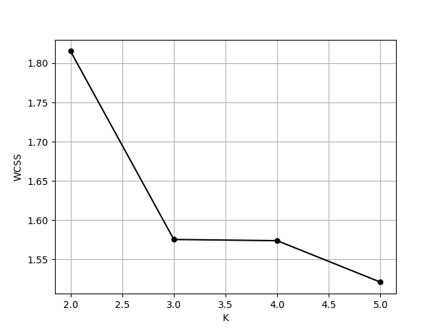
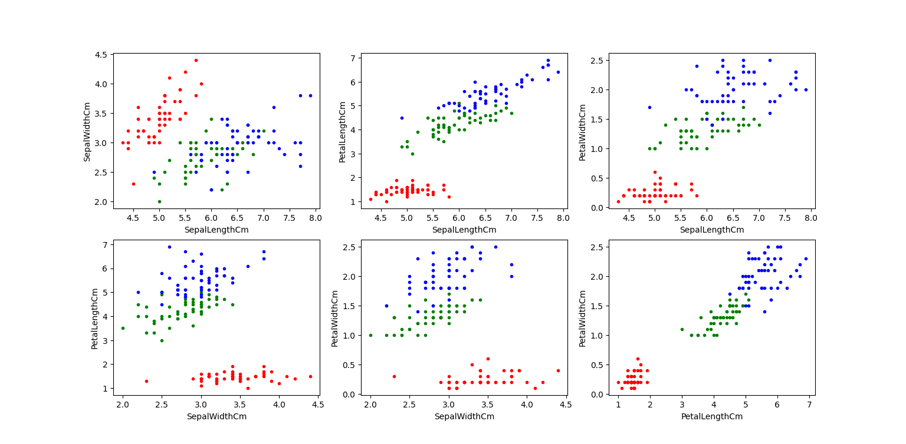
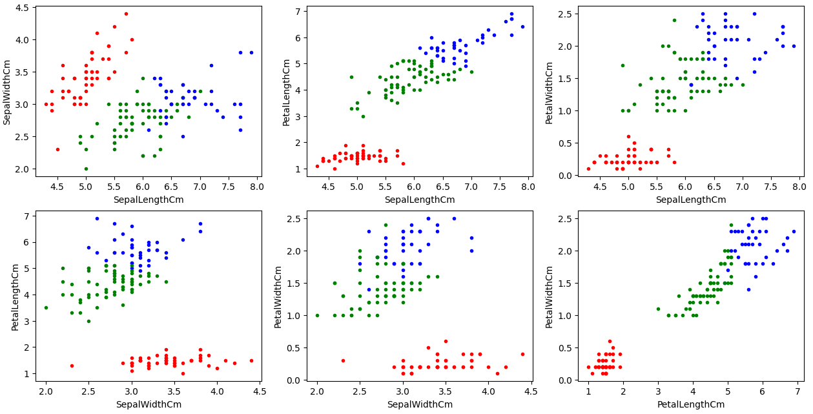

$`K`$-means clusterization algorithm is written from scratch in NumPy, and is applied to the [Iris dataset](https://en.wikipedia.org/wiki/Iris_flower_data_set). 
## The algorithm
Given the dataset $`\textbf{X} = \left\{ \textbf{x}_i \right\}`$, $`K`$ and `N_ITER`, we choose $`K`$ points from $`\textbf{X}`$ at random as centroids $`\left\{ \boldsymbol{\mu}_i \right\}_{i=1}^K`$, 
assign each point $`\textbf{x}_i`$ to its nearest centroid $`\boldsymbol{\mu}_i`$, and then calculate new centroids $`\left\{ \hat{\boldsymbol{\mu}}_i \right\}_{i=1}^K `$ of the relusting clusters.
This procedure is done until convergence criterion 
```math
\max_{i=1,\dots,K} \left\| \boldsymbol{\mu}_i - \hat{\boldsymbol{\mu}}_i \right\| \le 0.001
```
is satisfied ($`L^2`$-norm), or the maximum number of iterations is exceeded (which we took 100). 

For the resulting clusterization $`\left\{ S_i \right\}_{i=1}^K`$, within cluster sum of squares (WCSS) is calculated:
```math
\text{WCSS} = \sum_{i=1}^K \sum_{\textbf{x} \in S_i} \left\| \textbf{x} - \boldsymbol{\mu}_i \right\|^2
```
This whole process is repeated `N_ITER` times (Lloyd's algorithm), and in the end clusterization with the minimal value of WCSS is returned.
## The choice of $`K`$
Number of clusters $`K`$ was chosen via elbow method: that is, by identifying the [elbow](https://en.wikipedia.org/wiki/Knee_of_a_curve) 
of the graph $`\text{WCSS}(K)`$ plotted for $` K = 2, \dots, 6 `$.



Evidently, $`K = 3`$ is the elbow point.
## Results
Below is the dataset with true labels shown:



and here is the result of clusterization (colors may be in different order if you run the program):



We can see that clusterization is done successfully: red cluster is identified correctly, blue and green clusters are mostly correct, with some errors
on their boundary.
