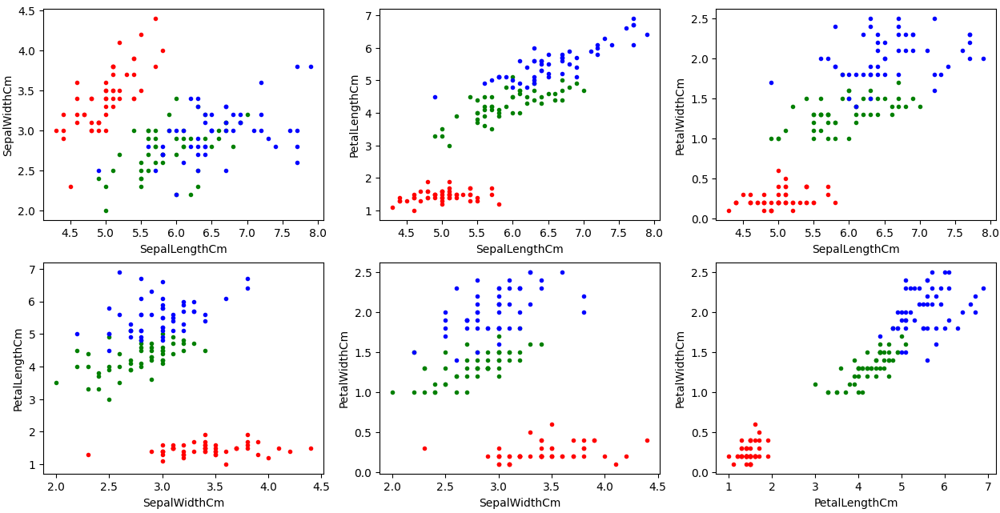

K-means clusterization algorithm is written from scratch in NumPy, and is applied to the [Iris dataset](https://en.wikipedia.org/wiki/Iris_flower_data_set). 

## The choice of K
Number of clusters K was chosen via elbow method: 

## Results
The original dataset looks like this:

The result of clusterization looks like this (colors may be in different order if you run the program):

We can see that clusterization is done successfully: red cluster is identified correctly, blue and green clusters are mostly correct, with some errors
on their boundary.
